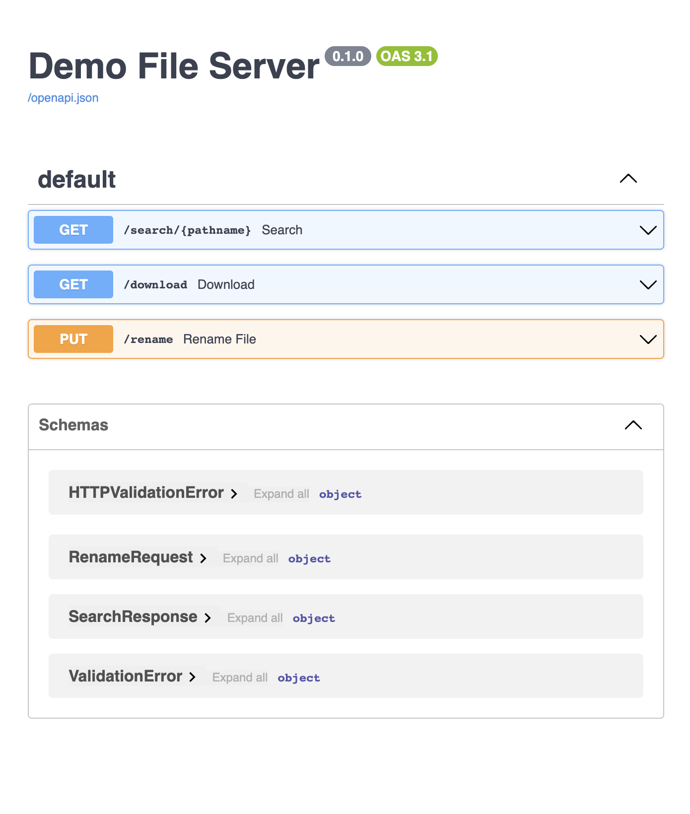

# FastAPI file server
This is a demo app showcasing a simple file server written in FastAPI

## Installing
First, install all dependencies (using `pip`).


```shell
python3 -m venv .venv      # skip if you don't need a virtual env
source .venv/bin/activate  # skip if you don't need a virtual env

pip install -r requirements.txt  # install dependencies
```

## Starting the server
This is just a demo, start the server in development mode.

### Note
The `./data/` directory is used for serving files. The server can only access files in that directory.
* you can change the dir by updating the `__DEFAULT_DATA_DIR` in `main.py`
* making the data dir configurable is a nice to have but not implemented here

```shell
uvicorn main:app --reload  # start server with autoreload (dev mode)
```

Starting the server exposes:
* Swagger at `http://127.0.0.1:8000/docs/`
* API at `http://127.0.0.1:8000`

The API documentation is available in Swagger.


## Examples:

### Search
```shell
curl -X 'GET' \
  'http://127.0.0.1:8000/search/red' \
  -H 'accept: application/json'

# {
#   "files": [
#    "folder_one/also_red.txt",
#    "folder_two/nested/red.png"
#   ]
# }
```

### Download

Use comma separated list of strings to download files:
* If a single file is requested it will be returned.
* If multiple files are requested they will be zipped and then returned

```shell
# returns a zip file (check ./data/)
curl -X 'GET' \
  'http://127.0.0.1:8000/download?q=folder_two%2Fgreen.png%2Cfolder_two%2Fworld.txt' \
  -H 'accept: application/json'

# returns a single file (check ./data/)
curl -X 'GET' \
  'http://127.0.0.1:8000/download?q=hello.txt' \
  -H 'accept: application/json'
```

See swagger for more (`http://127.0.0.1:8000/docs/`).


### Rename

Takes JSON data as input.
```shell

# rename hello.txt -> world.txt
curl -X 'PUT' \
  'http://127.0.0.1:8000/rename' \
  -H 'accept: application/json' \
  -H 'Content-Type: application/json' \
  -d '{
  "from_name": "hello.txt",
  "to_name": "world.txt"
}'

# HTTP STATUS OK (NULL)

# rename world.txt back to hello.txt
curl -X 'PUT' \
  'http://127.0.0.1:8000/rename' \
  -H 'accept: application/json' \
  -H 'Content-Type: application/json' \
  -d '{
  "from_name": "world.txt",
  "to_name": "hello.txt"
}'
# HTTP STATUS OK (NULL)
```
